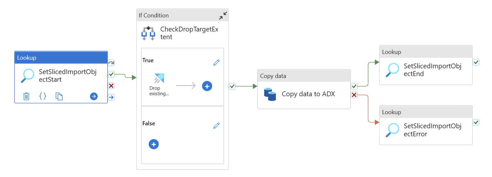
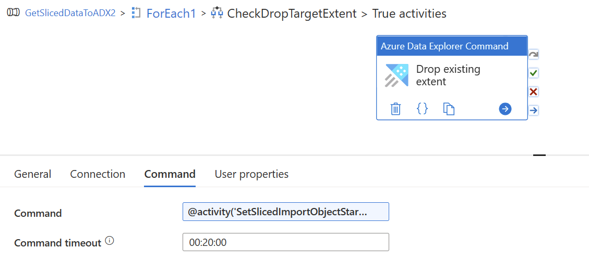

# ADF Synspase Pipeline ADX

## Sample Pipeline, copy data from relatinal DB (SQL Server) to ADX database

### Pipeline overview

### Pipeline If Condition, True activity

Drop existing extent.

 

 

 

|Porperty | Dynamic Content |
|---|---|
| Command | @activity('SetSlicedImportObjectStart').output.firstRow.ADX_DropExtentCommand |

