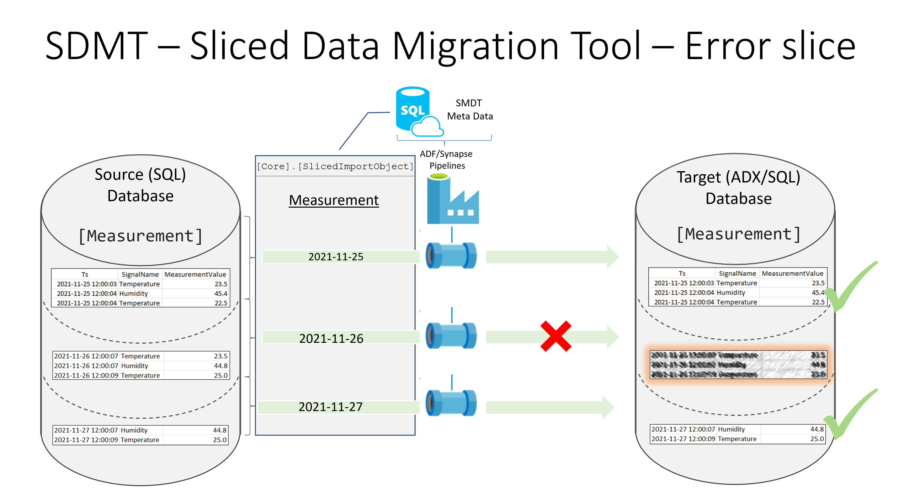
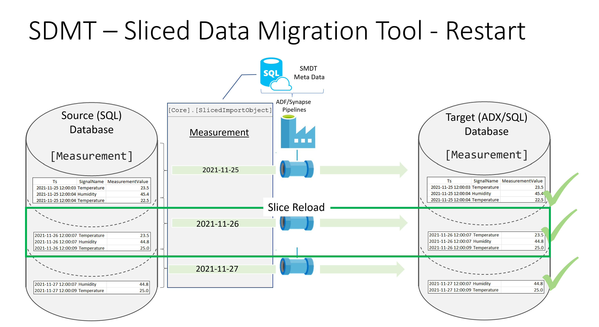
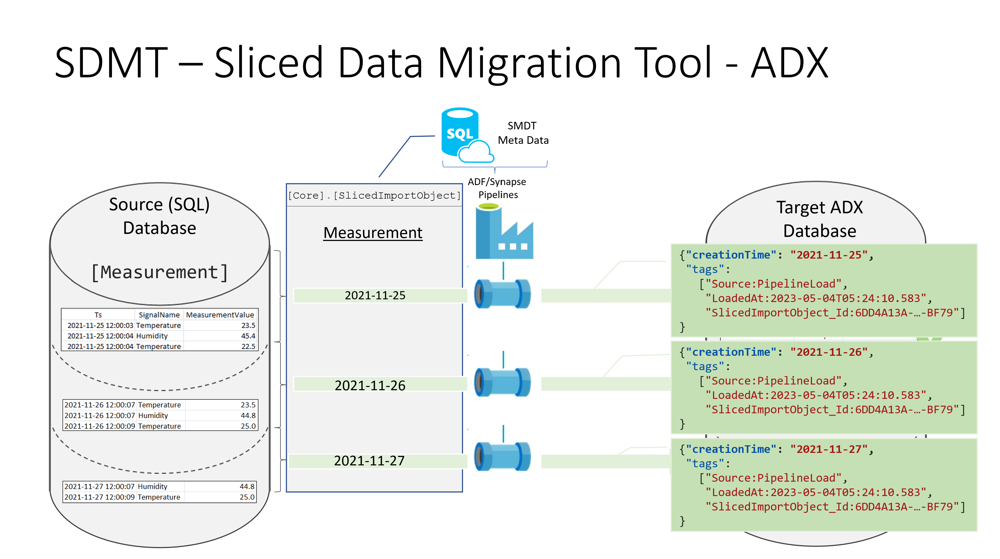

# SDMT - Sliced data migration toolbox

## Overview

If data is migrated from an on-premises system to a modern data warehouse or in an Azure Data eXplorer (ADX) database, then often historical data, must be migrated to the new data services in Azure.  
The sliced data migration toolbox provides framework components to simplify the data migration.

 
 

 
 

### Main Benefits of the toolbox

The toolbox provides the following main benefits

 * Huge datasets can be loaded in well defined slices
 * Slices can be loaded parallel (pipeline defines how many parallel loads are executed)
   * Data transfer workload can scale out over different integration runtimes to optimise performance
 * If a slice fails, then it can be restarted, without data duplication
 * Transfer is logged in the meta data database (duration, number of rows transferred)
 * If an ADX cluster is the target, then `creationTime` is set correctly and also the following `tags` are added 
   * "`Source`:PipelineLoad"
   * "`LoadedAt`:\<UTC date of data load\>",
   * "`SlicedImportObject_Id`:\<SlicedImportObject_Id of the slice \>"] 
 * Very simple and cost efficient ADF/Synapse pipelines
   * No complex logic within the pipelines
   * Full flexibility to extend and integrate the pipelines, according to the project requirements 

 

### Common transfer stages

Depending on the shape of the pipeline you can choose one of the following options:
 * SQL Source[^1] -> Database destination (e.g. SQL, PostgreSQL, ADX, ...) [^2] 
 * SQL Source[^1] -> Data lake -> Database destination (e.g. SQL, PostgreSQL, ADX, ...)[^2] 

 
 

[^1]: Any SQL source that is supported by ADF/Synpase pipelines. 
[^2]: Any pipeline sink that supports insert/apppend. Samples provided for Azure SQL and Azure Data Explorer.
[^3]: Date type is expected in the implemented sample. 

 
 

### Required Meta data

The backend of the toolbox is build in an Azure SQL Database and the real data transfer will be handled either by an Azure Data Factory or a Synapse pipeline.
The toolbox allows you to define:
 * Data transfer application name
 * Source object
 * Destination object
 * Start date 
 * End date
 * Filter attribute name [^3]
 * Slice size (day or month)
 * Max number of rows (for optional raw data parquet file in the data lake)

 

 
 

### High level view on direct transfer pipeline

 

For a direct transfer of the data slices just 5 (SQL Target) or 7 (ADX Target with error logging) are required.

#### Direct transfer to Azure SQL Database

#### Direct transfer to Azure ADX Database

 
 

### Higlight of the toolbox and the slice approach

 
 

If slices are not completed, then it will be reported in the meta data database.

 
 

And a single slice can be reload in a controlled fashion.

 
 

One great feature of ADX is the functionality to define chaching policies and to keep selected data in the hot cache. To be able to decide if data should be available in the hot cache, ADX keeps track on the age via meta data in the extent definition. If historical data is loaded, then it is essential that we provide the age of the records via a "hint". The toolbox provides this information direct as a property. 

