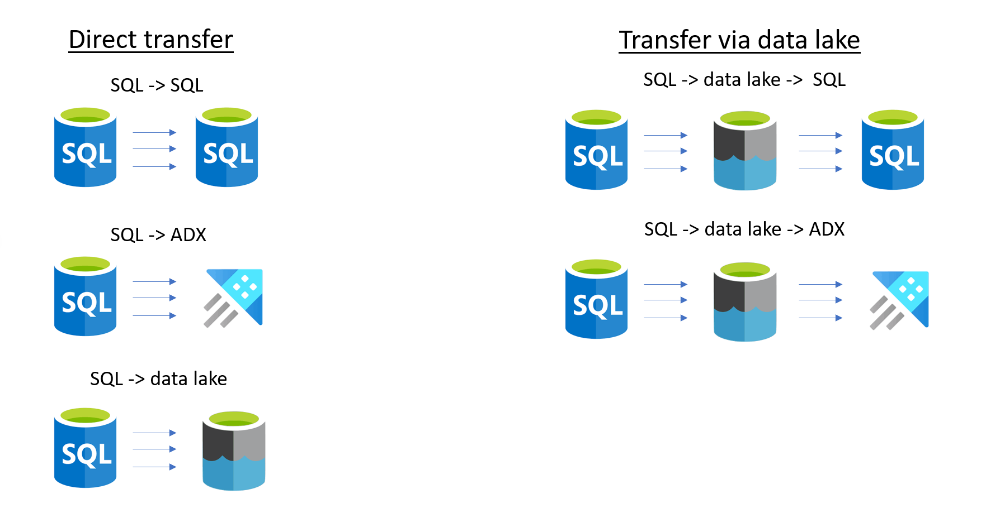

# SDMT - Sliced data migration toolbox

## Overview

If data is migrated from an on-premises system to a modern data warehouse or in an Azure Data eXplorer (ADX) database, then often historical data, must be migrated to the new data services in Azure.  
The sliced data migration toolbox provides framework components to simplify the data migration.

 
 

 
 

### Main Benefits of the toolbox

The toolbox provides the following main benefits

 * Huge datasets can be loaded in well defined slices
 * Slices can be loaded parallel (pipeline defines how many parallel loads are executed)
   * Data transfer workload can scale out over different integration runtimes to optimise performance
 * If a slice fails, then it can be restarted, without data duplication
 * Transfer is logged in the meta data database (duration, number of rows transferred)
 * If an ADX cluster is the target, then `creationTime` is set correctly and also the following `tags` are added 
   * "`Source`:PipelineLoad"
   * "`LoadedAt`:\<UTC date of data load\>",
   * "`SlicedImportObject_Id`:\<SlicedImportObject_Id of the slice \>"] 
 * Very simple and cost efficient ADF/Synapse pipelines
   * No complex logic within the pipelines
   * Full flexibility to extend and integrate the pipelines, according to the project requirements 

 

### Common transfer stages

Depending on the shape of the pipeline you can choose one of the following options:
 * SQL Source[^1] -> Database destination (e.g. SQL, PostgreSQL, ADX, ...) [^2] 
 * SQL Source[^1] -> Data lake -> Database destination (e.g. SQL, PostgreSQL, ADX, ...)[^2] 

 
 

[^1]: Any SQL source that is supported by ADF/Synpase pipelines. 
[^2]: Any pipeline sink that supports insert/apppend. Samples provided for Azure SQL and Azure Data Explorer.
[^3]: Date type is expected in the implemented sample. 

 
 

### Meta data

The backend of the toolbox is build in an Azure SQL Database and the real data transfer will be handled either by an Azure Data Factory or a Synapse pipeline.
The toolbox allows you to define:
 * Data transfer application name
 * Source object
 * Destination object
 * Start date 
 * End date
 * Filter attribute name [^3]
 * Slice size (day or month)
 * Max number of rows (for optional raw data parquet file in the data lake)

 

 
 

### Meta data database objects

For a direct transfer of the data slices just 5 (SQL Target) or 7 (ADX Target with error logging) are required.

#### Direct transfer to Azure SQL Database

#### Direct transfer to Azure ADX Database

 
 

### Meta data database objects

The following database objects and corresponding Data Factory/Synapse pipeline artifacts help to load datasets in slices. 
 
The core of the solutions build a small metadata/control table. A few Views/Store Procedures and Data Factory/Sypanpse pipelines are then used to transfer data and log the activity in the metadata table.
 
 
## Meatadata/Control Database Table

|Attribute name | Data type | Null | Default | Description |
| --- | --- | --- | --- | --- |
| [SlicedImportObject_Id]  |UNIQUEIDENTIFIER | NOT NULL | newid() | Primary key of the table. If it is not specified, then the system provides a value. |
| [SourceSystemName]      |  [sysname]        |  NOT NULL  |                      | String to identify objects that belong together | 
| [SourceSchema]          |  [sysname]        |  NOT NULL  |                      | Name of the schema in the source database. Used for documentation purpose. | 
| [SourceObject]          |  [sysname]        |  NOT NULL  |  | Name of the source table/view in the source system. Used for documentation purpose. | 
| [GetDataCommand]        |  NVARCHAR (MAX)   |  NULL      |                      |  select statement to read data from the source system. The attribute that can be used to slice the table must be included in the select list. A select * from table/view is valid, if all attributes should be transferred.               | 
| [FilterDataCommand]     |  NVARCHAR (1024)  |  NULL      |                      | Where condition to slice the data. It must start with the WHERE keyword.   The [FilterDataCommand] will be concatenated with the [GetDataCommand] to fetch data. | 
| [DestinationSchema]     |  [sysname]        |  NOT NULL  |                      | Schema name in the destination database.                 | 
| [DestinationObject]     |  [sysname]        |  NOT NULL  |                      | Table name in the destination database.                | 
| [ContainerName]         |  [sysname]        |  NULL      |                      | Container name in the datalake.                 | 
| [DestinationPath]       |  [sysname]        |  NULL      |                      | Directory path in the data lake e.g. raw/AdventureWorks/Sales/Product/202201                | 
| [DestinationFileName]   |  [sysname]        |  NULL      |                      | Filename (without extension)                | 
| [DestinationPostfix]    |  [sysname]        |  NULL      |                      |                 | 
| [DestinationFileFormat] |  VARCHAR (10)     |  NOT NULL  | ('.parquet')         |                 | 
| [MaxRowsPerFile]        |  INT              |  NULL      |                      | Maximal number of rows per File in data lake               | 
| [AdditionalContext]      |  VARCHAR (255)    |  NULL      |                      | e.g. for ADX '{"creationTime": "2022.01.01"}'     | 
| [LastStart]             |  DATETIME         |  NULL      |                      | Last start of transfer pipeline for this slice                | 
| [LastSuccessEnd]        |  DATETIME         |  NULL      |                      | Last succesful end to end data transfer of this slice                | 
| [RowsTransferred]       |  INT              |  NULL      |                      | Number of rows transferred | 
| [LastErrorMessage]      |  NVARCHAR (MAX)   |  NULL      |                      | Last known error                | 

 

### Sample data for a data transfer from a relational database, via data lake to another relational database
 

|SlicedImportObject_Id|SourceSystemName|SourceSchema|SourceObject|GetDataCommand|FilterDataCommand|DestinationSchema|DestinationObject|ContainerName|DestinationPath|DestinationFileName|MaxRowsPerFile|AdditionalContext|Active|LastStart|LastSuccessEnd|RowsTransferred|LastErrorMessage|CreatedBy|CreatedAt|
|---|---|---|---|---|---|---|---|---|---|---|---|---|---|---|---|---|---|---|---|
|942dc3dd-c3e9-ed11-8e89-000d3a22bf79|AdventureWorksLT|SalesLT|Product|SELECT [ProductID], [Name], [ProductNumber], [Color], [SellStartDate] FROM [SalesLT].[Product]|WHERE [SellStartDate] &gt;= CONVERT(DATETIME, &#39;2002-06-01&#39;,120) AND [SellStartDate]  &lt; CONVERT(DATETIME, &#39;2002-07-01&#39;,120)|SalesLT_SDMT|Product|adftopowerbi|AdventureWorksLT/SalesLT/Product/2002/06/01|AdventureWorksLT_SalesLT_Product_20020601_20020630|NULL|{&quot;creationTime&quot;: &quot;2002-06-01&quot;,&quot;tags&quot;:[&quot;Source:PipelineLoad&quot;]}|1|2023-05-03 15:05:29.650|NULL|NULL|NULL|xxx.yyy@microsoft.com|2023-05-03 15:04:57.670|
|952dc3dd-c3e9-ed11-8e89-000d3a22bf79|AdventureWorksLT|SalesLT|Product|SELECT [ProductID], [Name], [ProductNumber], [Color], [SellStartDate] FROM [SalesLT].[Product]|WHERE [SellStartDate] &gt;= CONVERT(DATETIME, &#39;2002-07-01&#39;,120) AND [SellStartDate]  &lt; CONVERT(DATETIME, &#39;2002-08-01&#39;,120)|SalesLT_SDMT|Product|adftopowerbi|AdventureWorksLT/SalesLT/Product/2002/07/01|AdventureWorksLT_SalesLT_Product_20020701_20020731|NULL|{&quot;creationTime&quot;: &quot;2002-07-01&quot;,&quot;tags&quot;:[&quot;Source:PipelineLoad&quot;]}|1|2023-05-03 15:05:30.723|2023-05-03 15:06:05.353|0|NULL|xxx.yyy@microsoft.com|2023-05-03 15:04:57.677|

### Sample data for a data transfer from a relational database to an Azure Data Explorer
 

SlicedImportObject_Id | SourceSystemName      | SourceSchema | SourceObject   | GetDataCommand                                                                   | FilterDataCommand | DestinationSchema | DestinationObject | ContainerName | DestinationPath | DestinationFileName | DestinationPostfix | DestinationFileFormat | MaxRowsPerFile | AdditionalContext                | LastStart | LastSuccessEnd | RowsTransferred | LastErrorMessage | CreatedBy                  | CreatedAt
----------------------|----------------------|--------------|----------------|---------------------------------------------------------------------------------|-------------------|-------------------|-------------------|---------------|----------------|---------------------|--------------------|-----------------------|----------------|----------------------------------|-----------|----------------|----------------|------------------|----------------------------|-----------
37C8B38B-B913-4593-B1F2-68EDCB5DC600 | AdventureWorksLT_ADX | SalesLT      | SalesOrderHeader | "SELECT [SalesOrderID], [RevisionNumber], [OrderDate], [Status] FROM [SalesLT].[SalesOrderHeader]" | WHERE [SalesOrderID] < 71816 | na                | SalesOrderHeader  | na            | na             | na                  | NULL               | .parquet              | NULL           | {"creationTime": "2022.01.01"}    | NULL  | NULL        | NULL              | NULL             | XYZ@microsoft.com | 31:31.4
2A1ACA0A-F6F4-4E66-8210-BDA581CD28B7 | AdventureWorksLT_ADX | SalesLT      | SalesOrderHeader | "SELECT [SalesOrderID], [RevisionNumber], [OrderDate], [Status] FROM [SalesLT].[SalesOrderHeader]" | WHERE [SalesOrderID] >= 71816 | na                | SalesOrderHeader  | na            | na             | na                  | NULL               | .parquet              | NULL           | {"creationTime": "2023.01.01"}    | NULL  | NULL        | NULL             | NULL             | XYZ@microsoft.com | 31:31.5

 
The most important column from ADX perspective is `AdditionalContext` there you can specify the creationTime value (e.g.{"creationTime": "2023.01.01"}) that will be used for the extent in ADX.

 
 

## Stored Procedures

| Name                        | Description |
|-----------------------------| ---|
| GetSetSlicedImportObjectToLoad | Get a list of slices that should be loaded |
| ResetSlicedImportObject       | Reset a single slice or all slices for a specified SourceSystem |
| SetSlicedImportObjectStart    | Mark a slice as transfer started |
| SetSlicedImportObjectEnd      | Mark a slice as successfully transferred |
| SetSlicedImportObjectError    | Mark a slice as transfer started |
| GetADXDropExtentsCommand | Get ADX/KQL command to drop existing extents |

 

------

## [Core].[GetSetSlicedImportObjectToLoad]

This stored procedure retrieves a list of sliced import objects to load based on the specified source system name and mode.

| Parameter Name | Data Type | Purpose |
| -------------- | --------- | ------- |
| @SourceSystemName | sysname | The name of the source system to retrieve sliced import objects for. |
| @Mode | VARCHAR(25) | An optional parameter to specify the mode of operation.   If set to `REGULAR`, the procedure will only retrieve sliced import objects where the `LastStart` column is null.   If set to `RESTART`, it will only retrieve sliced import objects where the `LastStart` column is not null and the `LastSuccessEnd` column is null.   If set to `ALL`, it will retrieve all sliced import objects regardless of their status. |

 

## [Core].[ResetSlicedImportObject]

The stored procedure resets the values of `LastStart`, `LastSuccessEnd`, `LastErrorMessage`, and `RowsTransferred` columns of a row in the `[Core].[SlicedImportObject]` table. This procedure takes two optional parameters: `@SourceSystemName` and `@SlicedImportObject_Id`. If `@SourceSystemName` is provided, the procedure updates all rows with the matching source system name. If `@SlicedImportObject_Id` is provided, the procedure updates only the row with the matching SlicedImportObject_Id. If both parameters are provided, the procedure updates only the row with the matching SlicedImportObject_Id and source system name.

Table of Parameters:

| Parameter Name | Data Type         | Purpose                                                      |
|----------------|------------------|--------------------------------------------------------------|
| @SourceSystemName | sysname (optional) | Specifies the source system name to filter the rows to update. |
| @SlicedImportObject_Id | uniqueidentifier (optional) | Specifies the SlicedImportObject_Id of the row to update. If provided with @SourceSystemName, only the row with the matching SlicedImportObject_Id and source system name will be updated. If provided alone, only the row with the matching SlicedImportObject_Id will be updated. If not provided, all rows with the matching @SourceSystemName will be updated. |

 

## [Core].[SetSlicedImportObjectEnd]

This stored procedure updates the `LastSuccessEnd` and `RowsTransferred` columns of the sliced import objects table for the specified sliced import object ID.

| Parameter Name | Data Type | Purpose |
| -------------- | --------- | ------- |
| @SlicedImportObject_Id | uniqueidentifier | The ID of the sliced import object to update. |
| @RowsTransferred | int | The number of rows transferred for the sliced import object. |

 

## [Core].[SetSlicedImportObjectStart]

This stored procedure updates the `LastStart`, `LastSuccessEnd`, and `LastErrorMessage` columns of the sliced import objects table for the specified sliced import object ID.

| Parameter Name | Data Type | Purpose |
| -------------- | --------- | ------- |
| @SlicedImportObject_Id | uniqueidentifier | The ID of the sliced import object to update. |

 

## [Core].[SetSlicedImportObjectError]

The stored procedure "SetSlicedImportObjectError" updates the `LastSuccessEnd` and `LastErrorMessage` columns in the `Core.SlicedImportObject` table for a given `SlicedImportObject_Id`. 

Table of Parameters:

| Parameter Name | Data Type  | Purpose                                                    |
|----------------|------------|------------------------------------------------------------|
| SlicedImportObject_Id | uniqueidentifier | Identifier for the SlicedImportObject whose LastSuccessEnd and LastErrorMessage values need to be updated |
| Error | NVARCHAR(MAX) | Error message to be stored in the LastErrorMessage column for the SlicedImportObject_Id |

## [Core].[GetADXDropExtentsCommand]

This stored procedure returns a command that can be executed to drop extents for a specified source system name and mode. The command includes the destination object name and creation time for each slice.

| Parameter | Data Type | Purpose |
|-----------|-----------|---------|
| @SourceSystemName | sysname | Specifies the name of the source system for which to generate the drop extents command. |
| @Mode | VARCHAR(25) | Specifies the mode for which to generate the drop extents command. Valid values are 'StartedSlices' and 'AllSlices'.  If 'StartedSlices' is specified, only slices that have been started but not successfully ended will be included in the command.  If 'AllSlices' is specified, all slices will be included in the command. |

The stored procedure returns a result set with a single column named 'DropExtends'. The column contains concatenated strings that represent ADX commands to drop extents for the specified source system name and mode.
  The command can be exectuted in the ADX cluster to drop data extents. It is useful if the data load of some slices not 100% succeeded and if the slice should be reloaded.

<pre>
.execute database script <| 
.drop extents <| .show table SalesOrderHeader extents  |  where MinCreatedOn ==  '2023-01-01'
.drop extents <| .show table SalesOrderHeader extents  |  where MinCreatedOn ==  '2022-01-01'
</pre>

 

## [Helper].[GenerateSliceMetaData]

The stored procedure called `[Helper].[GenerateSliceMetaData]` can be used to create the necessary metadata for slicing large data sets into smaller pieces based on a specified resolution, date range, and maximum number of rows per file, if data will be stored in the data lake. 

 

|Parameter Name | Data Type   | Default | Description |
|---------------|-------------|---------|-------------|
|@LowWaterMark  |DATE         |'2022.01.01'|The lower bound of the date range to generate slices for.|
|@HigWaterMark  |DATE         |'2022.03.01'|The upper bound of the date range to generate slices for.|
|@Resolution    |VARCHAR(25)  |'day'    |The time interval at which to generate slices. Valid values are 'day' and 'month'.|
|@SourceSystemName|sysname    |N/A      |The name of the source system for the data.|
|@SourceSchema  |sysname      |N/A      |The name of the schema containing the source object.|
|@SourceObject  |sysname      |N/A      |The name of the source object.|
|@GetDataCommand|nvarchar(max)|N/A      |The SQL command used to retrieve the source data.|
|@DateFilterAttributeName|sysname|N/A |The name of the attribute in the source data that contains the date.|
|@DateFilterAttributeType|sysname|N/A |The data type of the date attribute.|
|@DestinationSchema|sysname   |N/A      |The name of the destination schema.|
|@DestinationObject|sysname   |N/A      |The name of the destination object.|
|@ContainerName |sysname      |N/A      |The name of the container where the sliced data will be stored.|
|@AlternativeRootFolder|sysname|NULL   |If provided, then this value is used instead of the @SourceSystemName to create the directory path.|
|@MaxRowsPerFile|int         |NULL     |The maximum number of rows to include in each slice file. |

| Name                    | Data Type    | Purpose                                               |
|-------------------------|--------------|-------------------------------------------------------|
| @LowWaterMark           | DATE         | Lower date boundary (inclusive)                       |
| @HigWaterMark           | DATE         | Upper date boundary (exclusive)                       |
| @Resolution             | VARCHAR(25)  | Time resolution (day or month)                        |
| @SourceSystemName       | sysname      | Source system name                                    |
| @SourceSchema           | sysname      | Source schema name                                    |
| @SourceObject           | sysname      | Source object name                                    |
| @GetDataCommand         | nvarchar(max)| Data retrieval command                                |
| @DateFilterAttributeName| sysname      | Date filter attribute name                            |
| @DateFilterAttributeType| sysname      | Date filter attribute type                            |
| @DestinationSchema      | sysname      | Destination schema name                               |
| @DestinationObject      | sysname      | Destination object name                               |
| @ContainerName          | sysname      | Container name                                        |
| @AlternativeRootFolder  | sysname      | Alternative root folder (optional)                    |
| @MaxRowsPerFile         | int          | Maximum number of rows per file (optional)           |
| @IngestionMappingName   | sysname      | Ingestion mapping name (optional)                     |