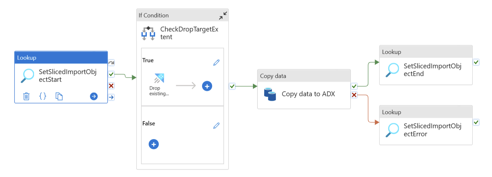
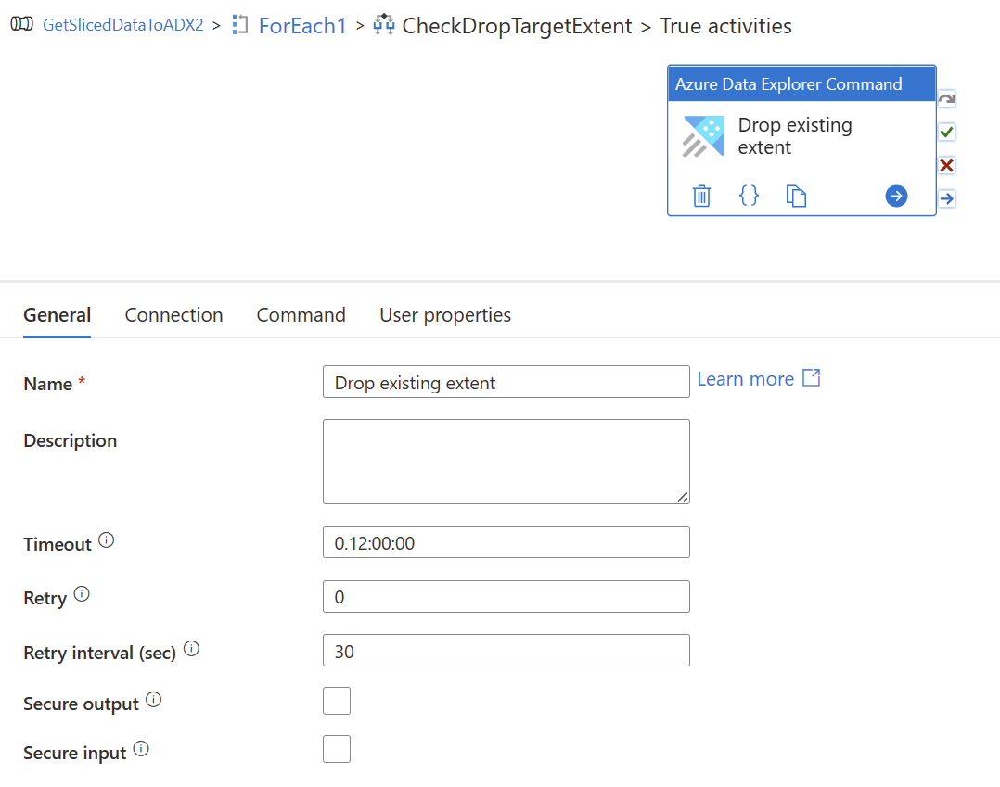
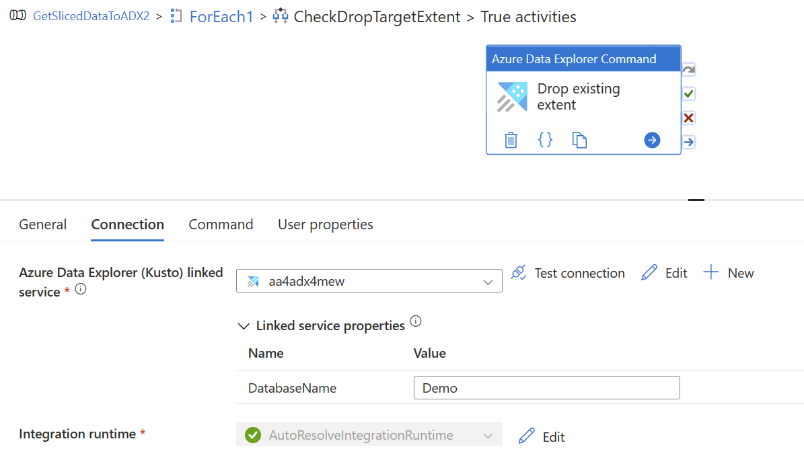
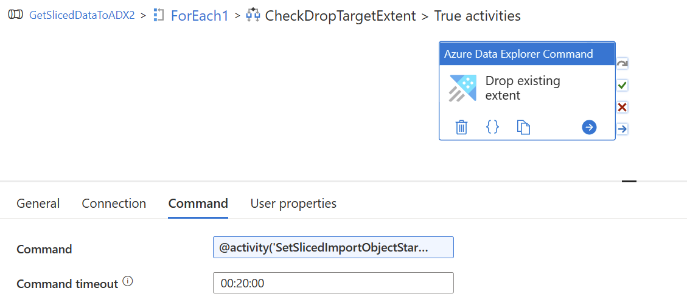

# ADF Synspase Pipeline ADX

## Meta data, slice definitions

The content of the table `[Core].[SlicedImportObject]` steers the whole data transfer and build the core of the soution.

 

If a date/datetime attribute is used to define the slice borders, then the stored proceudere `[Helper].[GenerateSliceMetaData]` can be used to generate the meta data definition.

 

### Generate slices for a transfer to an ADX cluster

The following code generates all the necessary metadata to copy data from the table `[Core].[Measurement]` in day slices for the days ‘2021-11-25’, ‘2021-11-26’, and ‘2021-11-27’ into the ADX table `Measurement`.

    DECLARE  @LowWaterMark     DATE         = '2021-11-25'   -- GE
            ,@HigWaterMark     DATE         = '2021-11-28'   -- LT   
            ,@Resolution       VARCHAR(25)  = 'Day'   -- Day/Month
     	    ,@SourceSystemName sysname      = 'BuildingTelemetry'
     	    ,@ContainerName    sysname      = 'adftopowerbi'
       
    EXEC [Helper].[GenerateSliceMetaData] 
             @LowWaterMark            = @LowWaterMark
            ,@HigWaterMark            = @HigWaterMark
            ,@Resolution              = @Resolution
            ,@SourceSystemName        = @SourceSystemName
     	    ,@SourceSchema            = 'Core'
     		,@SourceObject            = 'Measurement'
     		,@GetDataCommand          = 'SELECT [Ts], [SignalName], [MeasurementValue] FROM [Core].[Measurement]'
     		,@DateFilterAttributeName = '[Ts]'
     		,@DateFilterAttributeType = 'DATETIME2(3)' -- Datatype should match to source table
     		,@DestinationObject       = 'Measurement'
     		,@ContainerName           = @ContainerName
        

## Sample Pipeline, copy data from relatinal DB (SQL Server) to ADX database

### Pipeline overview

### Pipeline If Condition, True activity

Drop existing extent.

 

 

 

|Porperty | Dynamic Content |
|---|---|
| Command | @activity('SetSlicedImportObjectStart').output.firstRow.ADX_DropExtentCommand |

